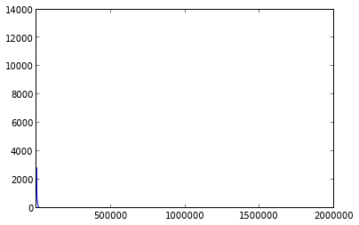
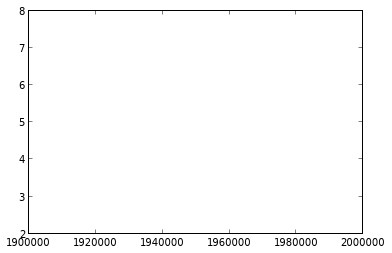

As previously said, ISTA is not the version used.

However, this version has the advantage to be monotone. Thus, it is practical to test the prox functions as well as the sub-functions.

Hence these tests to check the correctness of all the sub-functions used.

Loading iris dataset
====================

A toy dataset, the famous "iris dataset" is used. 

We build simple linear kernel by using scalar product.

In[2]:

.. code:: python

    from ista import Ista
    from sklearn.datasets import load_iris
    import numpy as np
    
    data = load_iris()
    
    y = data.target
    X = data.data
    
    X = X[y<2]
    y = y[y<2]
    y[y==0] = -1
    
    K1 = X[:, 0]
    K2 = X[:, 1]
    K3 = X[:, 2]
    K4 = X[:, 3]
    
    K1 = np.dot(K1[:, np.newaxis], K1[:, np.newaxis].transpose())
    K2 = np.dot(K2[:, np.newaxis], K2[:, np.newaxis].transpose())
    K3 = np.dot(K3[:, np.newaxis], K3[:, np.newaxis].transpose())
    K4 = np.dot(K4[:, np.newaxis], K4[:, np.newaxis].transpose())
    X = np.concatenate((K1, K2, K3, K4), axis=1)
    
    ista = Ista(loss='squared-hinge', penalty='l12', lambda_=0.5, n_iter=200000)

No penalisation (lambda_=0)
===========================

Here we use no penalisation.

In[3]:

.. code:: python

    ista.lambda_= 0
    ista.penalty='l12'
    ista.fit(X, y, verbose=1)
    print "Percent of good classification : %d/100" % ista.score(X, y)
    print "Number of nulled coefficients : %d/%d" % (len(ista.coefs_[ista.coefs_==0]), len(ista.coefs_))

.. parsed-literal::

    
    objective_function : 0.000000
    dual_objective_function : 0.000001
    dual_penalisation : 0.000000
    dual_loss : 0.000001
    Percent of good classification : 100/100
    Number of nulled coefficients : 0/400

As expected, the objective functions steadily decrease.

Using penalisation (lambda_=0.1)
================================

In[4]:

.. code:: python

    ista.lambda_= 0.1
    ista.n_iter = 2000000
    ista.penalty='l12'
    ista.fit(X, y, verbose=1)
    print "Percent of good classification : %d/100" % ista.score(X, y)
    print "Number of nulled coefficients : %d/%d" % (len(ista.coefs_[ista.coefs_==0]), len(ista.coefs_))

.. parsed-literal::

    
    objective_function : 0.003816
    dual_objective_function : -2.564050
    dual_penalisation : 2.594772
    dual_loss : 0.030722
    Percent of good classification : 100/100
    Number of nulled coefficients : 99/400

Again, the objective functions steadily decrease.
However, it seems that there is a numerical instability.

Dual gap evolution
==================

In[5]:

.. code:: python

    len(ista.iteration_dual_gap)

Out[5]:

.. parsed-literal::

    2000000

In[6]:

.. code:: python

    plot(ista.iteration_dual_gap[1000:])

Out[6]:

.. parsed-literal::

    [<matplotlib.lines.Line2D at 0x3529490>]

In[7]:

.. code:: python

    plot(ista.iteration_dual_gap[10000:])

Out[7]:

.. parsed-literal::

    [<matplotlib.lines.Line2D at 0x355f190>]

.. image:: Test_ISTA_files/Test_ISTA_fig_01.png

In[8]:

.. code:: python

    plot(ista.iteration_dual_gap[100000:])

Out[8]:

.. parsed-literal::

    [<matplotlib.lines.Line2D at 0x34cc450>]

In[9]:

.. code:: python

    plot(ista.iteration_dual_gap[150000:])

Out[9]:

.. parsed-literal::

    [<matplotlib.lines.Line2D at 0x3917b10>]

In[13]:

.. code:: python

    plot(ista.iteration_dual_gap[1900000:])

Out[13]:

.. parsed-literal::

    [<matplotlib.lines.Line2D at 0x3ff1790>]

Objective function evolution
============================

In[14]:

.. code:: python

    len(ista.iteration_objective)

Out[14]:

.. parsed-literal::

    2000000

In[16]:

.. code:: python

    plot(ista.iteration_objective[1000:])

Out[16]:

.. parsed-literal::

    [<matplotlib.lines.Line2D at 0x4355150>]

.. image:: Test_ISTA_files/Test_ISTA_fig_05.png

In[17]:

.. code:: python

    plot(ista.iteration_objective[10000:])

Out[17]:

.. parsed-literal::

    [<matplotlib.lines.Line2D at 0x3f2d9550>]

.. image:: Test_ISTA_files/Test_ISTA_fig_06.png

In[18]:

.. code:: python

    plot(ista.iteration_objective[100000:])

Out[18]:

.. parsed-literal::

    [<matplotlib.lines.Line2D at 0x3f4f46d0>]

.. image:: Test_ISTA_files/Test_ISTA_fig_07.png

Evolution of the dual objective function
========================================

In[21]:

.. code:: python

    plot(ista.iteration_dual_objective[10000:])

Out[21]:

.. parsed-literal::

    [<matplotlib.lines.Line2D at 0x3fc356d0>]

In[22]:

.. code:: python

    plot(ista.iteration_dual_objective[100000:])

Out[22]:

.. parsed-literal::

    [<matplotlib.lines.Line2D at 0x3fc65e50>]

.. image:: Test_ISTA_files/Test_ISTA_fig_09.png

