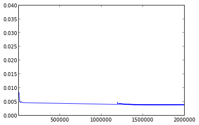
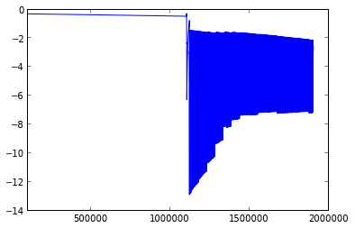

As previously said, ISTA is not the version used.

However, this version has the advantage to be monotone. Thus, it is practical to test the prox functions as well as the sub-functions.

Loading iris dataset
====================

A toy dataset, the famous "iris dataset" is used. 

We build simple linear kernel by using scalar product.

In[2]:

.. code:: python

    from ista import Ista
    from sklearn.datasets import load_iris
    import numpy as np
    
    data = load_iris()
    
    y = data.target
    X = data.data
    
    X = X[y<2]
    y = y[y<2]
    y[y==0] = -1
    
    K1 = X[:, 0]
    K2 = X[:, 1]
    K3 = X[:, 2]
    K4 = X[:, 3]
    
    K1 = np.dot(K1[:, np.newaxis], K1[:, np.newaxis].transpose())
    K2 = np.dot(K2[:, np.newaxis], K2[:, np.newaxis].transpose())
    K3 = np.dot(K3[:, np.newaxis], K3[:, np.newaxis].transpose())
    K4 = np.dot(K4[:, np.newaxis], K4[:, np.newaxis].transpose())
    X = np.concatenate((K1, K2, K3, K4), axis=1)
    
    ista = Ista(loss='squared-hinge', penalty='l12', lambda_=0.5, n_iter=200000)

No penalisation (lambda_=0)
===========================

Here we use no penalisation.

In[3]:

.. code:: python

    ista.lambda_= 0
    ista.penalty='l12'
    ista.fit(X, y, verbose=1)
    print "Percent of good classification : %d/100" % ista.score(X, y)
    print "Number of nulled coefficients : %d/%d" % (len(ista.coefs_[ista.coefs_==0]), len(ista.coefs_))

.. parsed-literal::

    iteration 0 == primal objective : 95.985159, dual objective : 49.478681, dual_gap : 46.506478
    iteration 1000 == primal objective : 0.445664, dual objective : 1.795117, dual_gap : 1.349453

.. parsed-literal::

    
    iteration 2000 == primal objective : 0.220601, dual objective : 0.913353, dual_gap : 0.692752

.. parsed-literal::

    
    iteration 3000 == primal objective : 0.155845, dual objective : 0.614400, dual_gap : 0.458555

.. parsed-literal::

    
    iteration 4000 == primal objective : 0.123040, dual objective : 0.518957, dual_gap : 0.395916

.. parsed-literal::

    
    iteration 5000 == primal objective : 0.098027, dual objective : 0.468776, dual_gap : 0.370749

.. parsed-literal::

    
    iteration 6000 == primal objective : 0.078120, dual objective : 0.422808, dual_gap : 0.344688

.. parsed-literal::

    
    iteration 7000 == primal objective : 0.062277, dual objective : 0.380856, dual_gap : 0.318580

.. parsed-literal::

    
    iteration 8000 == primal objective : 0.049665, dual objective : 0.342682, dual_gap : 0.293017

.. parsed-literal::

    
    iteration 9000 == primal objective : 0.039624, dual objective : 0.308032, dual_gap : 0.268408

.. parsed-literal::

    
    iteration 10000 == primal objective : 0.031630, dual objective : 0.276649, dual_gap : 0.245020

.. parsed-literal::

   
    iteration 20000 == primal objective : 0.003491, dual objective : 0.091781, dual_gap : 0.088291

.. parsed-literal::
    
    iteration 30000 == primal objective : 0.000478, dual objective : 0.030574, dual_gap : 0.030097

.. parsed-literal::
   
    iteration 40000 == primal objective : 0.000076, dual objective : 0.012214, dual_gap : 0.012138
   
    iteration 50000 == primal objective : 0.000012, dual objective : 0.004865, dual_gap : 0.004853

.. parsed-literal::
   
    iteration 80000 == primal objective : 0.000000, dual objective : 0.000306, dual_gap : 0.000306

.. parsed-literal::
    
    iteration 142000 == primal objective : 0.000000, dual objective : 0.000001, dual_gap : 0.000001

.. parsed-literal::

    
    convergence at iteration : 142064
    dual gap : 0.000001

.. parsed-literal::

    
    objective_function : 0.000000
    dual_objective_function : 0.000001
    dual_penalisation : 0.000000
    dual_loss : 0.000001
    Percent of good classification : 100/100
    Number of nulled coefficients : 0/400

.. parsed-literal::

    /usr/lib/python2.7/site-packages/numpy/lib/utils.py:1132: DeprecationWarning: The compiler package is deprecated and removed in Python 3.x.
      import compiler

As expected, the objective functions steadily decrease.

Using penalisation (lambda_=0.1)
================================

In[4]:

.. code:: python

    ista.lambda_= 0.1
    ista.n_iter = 2000000
    ista.penalty='l12'
    ista.fit(X, y, verbose=1)
    print "Percent of good classification : %d/100" % ista.score(X, y)
    print "Number of nulled coefficients : %d/%d" % (len(ista.coefs_[ista.coefs_==0]), len(ista.coefs_))

.. parsed-literal::

    iteration 0 == primal objective : 95.985298, dual objective : -80764166.565843, dual_gap : 80764262.551141
    iteration 1000 == primal objective : 0.448685, dual objective : -13043.989186, dual_gap : 13044.437871

.. parsed-literal::

    
    iteration 2000 == primal objective : 0.223946, dual objective : -2826.587974, dual_gap : 2826.811920

.. parsed-literal::

    
    iteration 3000 == primal objective : 0.159390, dual objective : -1151.272325, dual_gap : 1151.431716

.. parsed-literal::

    
    iteration 4000 == primal objective : 0.126943, dual objective : -778.831352, dual_gap : 778.958295

.. parsed-literal::

    
    iteration 5000 == primal objective : 0.102297, dual objective : -622.445820, dual_gap : 622.548116

.. parsed-literal::

    
    iteration 20000 == primal objective : 0.008335, dual objective : -24.601880, dual_gap : 24.610216

.. parsed-literal::

    
    iteration 40000 == primal objective : 0.004764, dual objective : -1.787364, dual_gap : 1.792128

.. parsed-literal::

    
    iteration 90000 == primal objective : 0.004639, dual objective : -0.378365, dual_gap : 0.383004

.. parsed-literal::
    
    iteration 150000 == primal objective : 0.004614, dual objective : -0.303484, dual_gap : 0.308098

.. parsed-literal::
    
    iteration 175000 == primal objective : 0.004599, dual objective : -0.296884, dual_gap : 0.301483

.. parsed-literal::

    
    iteration 202000 == primal objective : 0.004583, dual objective : -0.299972, dual_gap : 0.304555

.. parsed-literal::
    
    iteration 300000 == primal objective : 0.004527, dual objective : -0.314015, dual_gap : 0.318542

.. parsed-literal::

    iteration 500000 == primal objective : 0.004411, dual objective : -0.344774, dual_gap : 0.349184

.. parsed-literal::
    
    iteration 1000000 == primal objective : 0.004121, dual objective : -0.430301, dual_gap : 0.434421

.. parsed-literal::
    
    iteration 1999000 == primal objective : 0.003866, dual objective : -2.879723, dual_gap : 2.883589

.. parsed-literal::

    
    dual gap : 2.567866

.. parsed-literal::

    
    objective_function : 0.003816
    dual_objective_function : -2.564050
    dual_penalisation : 2.594772
    dual_loss : 0.030722
    Percent of good classification : 100/100
    Number of nulled coefficients : 99/400

Again, the objective functions steadily decrease.
However, it seems that there is a numerical instability.

Dual gap evolution
==================

In[5]:

.. code:: python

    len(ista.iteration_dual_gap)

Out[5]:

.. parsed-literal::

    2000000

In[6]:

.. code:: python

    plot(ista.iteration_dual_gap[1000:])

Out[6]:

.. parsed-literal::

    [<matplotlib.lines.Line2D at 0x3529490>]

.. image:: Test_ISTA_files/Test_ISTA_fig_00.png

In[7]:

.. code:: python

    plot(ista.iteration_dual_gap[10000:])

Out[7]:

.. parsed-literal::

    [<matplotlib.lines.Line2D at 0x355f190>]

In[8]:

.. code:: python

    plot(ista.iteration_dual_gap[100000:])

Out[8]:

.. parsed-literal::

    [<matplotlib.lines.Line2D at 0x34cc450>]

.. image:: Test_ISTA_files/Test_ISTA_fig_02.png

In[9]:

.. code:: python

    plot(ista.iteration_dual_gap[150000:])

Out[9]:

.. parsed-literal::

    [<matplotlib.lines.Line2D at 0x3917b10>]

.. image:: Test_ISTA_files/Test_ISTA_fig_03.png

In[13]:

.. code:: python

    plot(ista.iteration_dual_gap[1900000:])

Out[13]:

.. parsed-literal::

    [<matplotlib.lines.Line2D at 0x3ff1790>]

.. image:: Test_ISTA_files/Test_ISTA_fig_04.png

Objective function evolution
============================

In[14]:

.. code:: python

    len(ista.iteration_objective)

Out[14]:

.. parsed-literal::

    2000000

In[16]:

.. code:: python

    plot(ista.iteration_objective[1000:])

Out[16]:

.. parsed-literal::

    [<matplotlib.lines.Line2D at 0x4355150>]

In[17]:

.. code:: python

    plot(ista.iteration_objective[10000:])

Out[17]:

.. parsed-literal::

    [<matplotlib.lines.Line2D at 0x3f2d9550>]

In[18]:

.. code:: python

    plot(ista.iteration_objective[100000:])

Out[18]:

.. parsed-literal::

    [<matplotlib.lines.Line2D at 0x3f4f46d0>]

.. image:: Test_ISTA_files/Test_ISTA_fig_07.png

Evolution of the dual objective function
========================================

In[21]:

.. code:: python

    plot(ista.iteration_dual_objective[10000:])

Out[21]:

.. parsed-literal::

    [<matplotlib.lines.Line2D at 0x3fc356d0>]

.. image:: Test_ISTA_files/Test_ISTA_fig_08.png

In[22]:

.. code:: python

    plot(ista.iteration_dual_objective[100000:])

Out[22]:

.. parsed-literal::

    [<matplotlib.lines.Line2D at 0x3fc65e50>]

